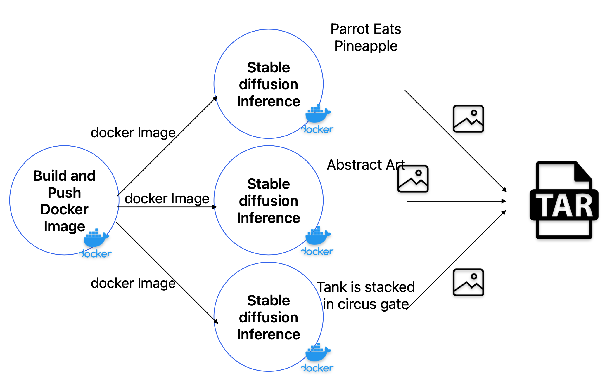
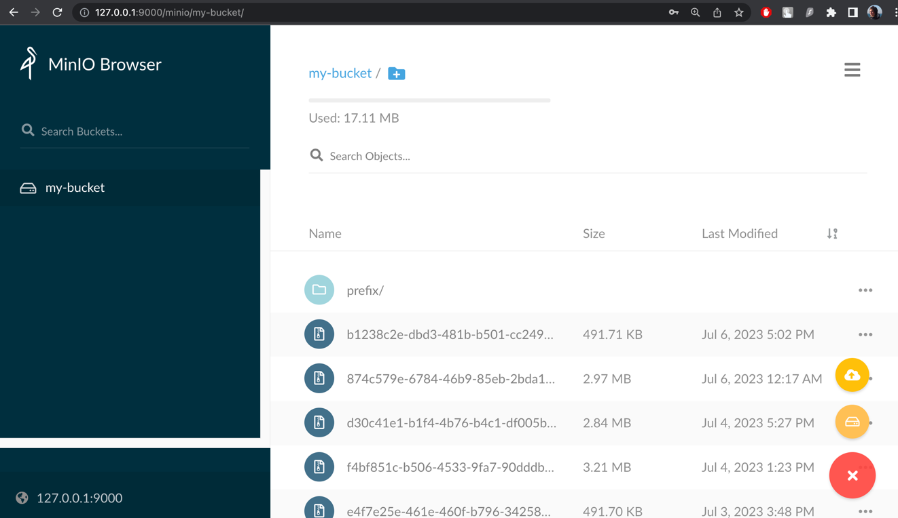
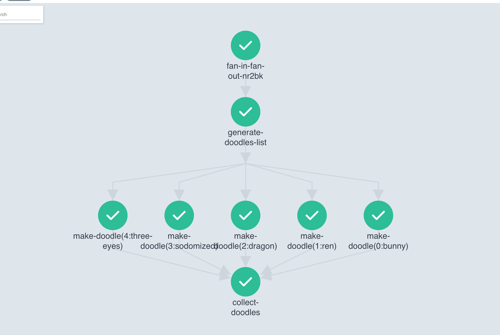
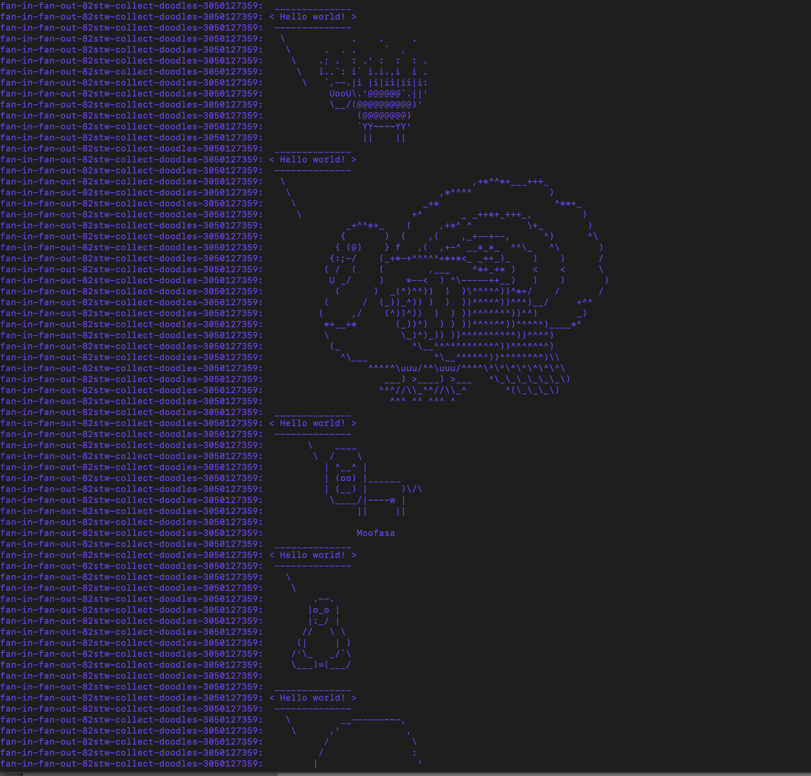
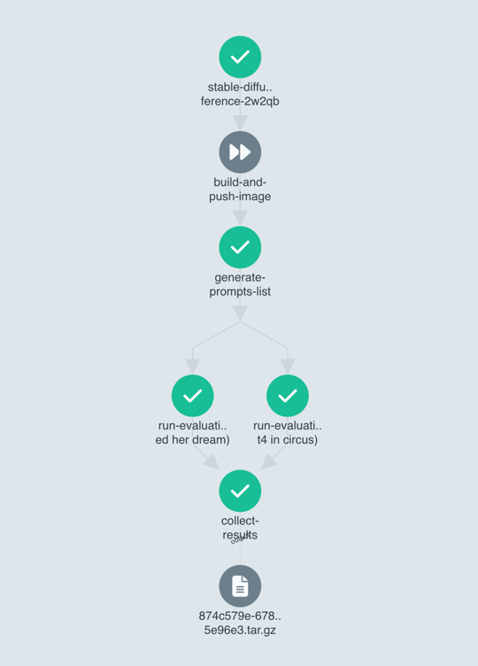

# Argo Workflow pipeline for Stable Diffusion Inference on Minikube cluster

This repository contains the Argo Workflow pipeline for 
Stable Diffusion Inference on Minikube cluster. It also contains argo workflow config for toy fan-in/fan-out pipeline.




Repository contains script to setup **minikube** cluster with **argo workflow** installed.

For **stable diffusion** pipeline the following repo is used: [stable-diffusion-docker](https://github.com/fboulnois/stable-diffusion-docker).

Cluster setup is defined in [create_minikube_cluster.sh](reate_minikube_cluster.sh).

The stable diffusion workflow is defined in [parallel_inference.yml](argo/parallel_inference.yml). 
It is executed by running `argo -n argo submit argo/parallel_inference.yml`. 

The fan-in/fan-out workflow is defined in [fan_in_fan_out.yml](argo/fan_in_fan_out.yml). 
It is executed by running `argo -n argo submit argo/fan_in_fan_out.yml`.

The code was tested on MacOs Intel with minikube v1.31.1 and kubectl v1.27.0.
Stable diffusion pipeline **doesn't work on MacOs M1**, though minikube setup and fan-in-fan-out example work.

To run fan-in/fan-out you'll need minimum of resources, but for stable diffusion you'll need at least 8GB of RAM.

# Setup

## Prerequisites

1. Sign up to [huggingface.co](https://huggingface.co/) and get hugging face token.
2. Sign up to [hub.docker.com](https://hub.docker.com/), create private repository and get docker token.
3. To install minikube you'll need driver. My personal preference is having [Docker](https://www.docker.com/) installed and **running**, so minikube use it as driver
4. Install [kubectl](https://kubernetes.io/docs/tasks/tools/install-kubectl/) and [minikube](https://minikube.sigs.k8s.io/docs/start/). It is better too install latest versions for both.

## Setup minikube cluster with argo workflow

1. In [create_minikube_cluster.sh](create_minikube_cluster.sh) check minikube cluster parameters and replace if needed:
```
export MINIKUBE_CLUSTER_RAM="17GB"
export MINIKUBE_CLUSTER_CPUS="4"
export MINIKUBE_CLUSTER_DISK_SIZE="40GB"
```
2. In [create_minikube_cluster.sh](create_minikube_cluster.sh) replace placeholders with your values:
```
export DOCKER_USERNAME=INSERT_YOUR_VALUE_HERE
export DOCKER_TOKEN=INSERT_YOUR_VALUE_HERE
export DOCKER_PASSWORD=INSERT_YOUR_VALUE_HERE
export DOCKER_EMAIL=INSERT_YOUR_VALUE_HERE
export HUGGINGFACE_TOKEN=INSERT_YOUR_VALUE_HERE
```
3. Run [create_minikube_cluster.sh](create_minikube_cluster.sh). 
```
bash create_minikube_cluster.sh
```

This command will create minikube cluster and argo namespace. 
Then it will install argo to the cluster and setup argo workflow executor. 
It will create secrets with docker and huggingface credentials to use in workflow.
It will set admin right to default account. Then it will create PVC (Persistent Volume Claim) for huggingface models caching.
Finally it will install Minio artifact repository to cluster and set it as default artifact repository for argo workflow.

4. Open Argo UI in browser. Run the following command. Then go to `http://localhost:2746` in your browser. If your browser saying it is not safe, still proceed
```
argo -n argo server --auth-mode=server
```
5. Open Minio UI in browser. Run the following command. Then go to `http://localhost:9000` in your browser. If your browser saying it is not safe, still proceed
```
kubectl -n argo get service argo-artifacts 
kubectl -n argo port-forward service/argo-artifacts 9000:9000
```
6. To login to Minio, get access key and secrets key with following commands.
```
export ACCESS_KEY=$(kubectl get secret argo-artifacts --namespace argo -o jsonpath="{.data.accesskey}" | base64 --decode)
export SECRET_KEY=$(kubectl get secret argo-artifacts --namespace argo -o jsonpath="{.data.secretkey}" | base64 --decode)
```
7. In Minio UI login with access key and secret key. Create bucket with name that you set in [create_minikube_cluster.sh](create_minikube_cluster.sh) script in DEFAULT_ARTIFACT_REPOSITORY variable.


# Run fan-in/fan-out toy example




This is argo workflow example with fan-in/fan-out pattern to autoscale workflow step.
In this workflow we run `cowsay` command in parallel with different characters option saying `input_phrase` parameter. 

It takes 2 parameters as input:
- `number_of_doodles` - number of characters to run cowsay with
- `input_phrase` - phrase to say

To run with default parameters, run `argo -n argo submit argo/fan_in_fan_out.yml`.

To change any of parameters, run `argo -n argo submit argo/fan_in_fan_out.yml -p number_of_doodles="10" -p input_phrase="Hello Moon"`.

# Run stable diffusion inference pipeline




This is argo workflow example with stable diffusion inference pipeline. Pipeline build docker image with stable diffusion inference and push it to docker hub.
Then it runs inference on input text prompts in parallel docker containers.

By default, it uses cpu for inference, but you can switch to gpu by changing `device` parameter to `cuda` in 
`docker-entrypoint.py` script command in [parallel_inference.yml](argo/parallel_inference.yml).
To generate images `dreamlike-art/dreamlike-photoreal-2.0` is used by default. And each prompt will produce 2 images.

It takes 4 parameters as input:
- `repo` - link to github repo to build docker image from. We use [stable-diffusion-docker](https://github.com/fboulnois/stable-diffusion-docker).
- `image` - docker image name to push to docker hub in a format `DOCKER_LOGIN/PRIVATE_REPO_NAME:TAG`.
- `if_build_image` - `true` or `false` value. If `false` will build and push image as first step of workflow. If `true` will skip image building and pull existing image.
- `input_prompts` - prompts to run inference on. Should be string divided by `;` symbol. Each prompt will produce 2 images.

Before running check `parallelism` parameter in [parallel_inference.yml](argo/parallel_inference.yml). It is set to `2` by default,
but it is better to set it according to your resources. For example, I was able to run it with `parallelism=2` on my MacOs Intel with 15GB of RAM and 4 CPU cores,
though original repo stated that one docker image requires 8GB of RAM and 4 CPU cores, so maybe you'll need to set `parallelism=1` or `parallelism=1` to run it on your machine.

To run with default parameters, run `argo -n argo submit argo/parallel_inference.yml -p image="DOCKER_LOGIN/PRIVATE_REPO_NAME:TAG"`.


